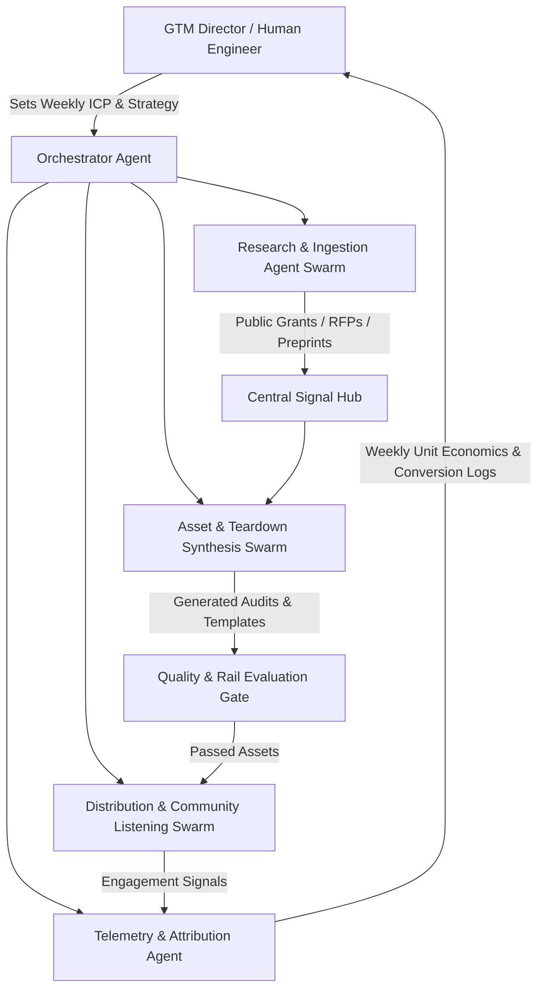

# Extras: 20-to-100 Person Autonomous GTM Architecture Blueprint

> **Strategic Vision**: How a single growth engineer steers a fleet of autonomous agents that execute the full go-to-market motion of an entire 50-person enterprise revenue team.

---

## 1. Multi-Agent Topology & Responsibilities

---

## 2. Agent Subsystems & Microservices

1. **Research & Ingestion Swarm (5 Virtual SDRs)**:
   - Continuously queries arXiv API, NIH Reporter, Grants.gov, and GitHub releases.
   - Extracts document metadata, author structures, and technical parameters into normalized PostgreSQL tables.
2. **Asset Synthesis Swarm (10 Virtual Solutions Architects)**:
   - Executes multi-pass LLM prompts to construct tailored proposal audits, cross-section dependency matrices, and sample refactor prompts.
3. **Deterministic Quality Gate (The Automated Compliance Officer)**:
   - Runs Python AST and regex checks: asserts zero PII, verifies guardrail adherence (no spreadsheet promises, no live web claims), and checks markdown formatting.
4. **Community & Inbound Hub (5 Virtual DevRel Advocates)**:
   - Publishes open-source resources, monitors technical forums for document friction queries, and drafts high-taste technical responses for human approval.

---

## 3. Human Steering Interface (The Morning 15-Minute Cockpit)

A single growth engineer manages this entire machine using a centralized stream:
- **0–5 min**: Inspect overnight batch telemetry (records processed, gate pass rate, cost/token metrics).
- **5–10 min**: Review and approve flagged edge-case assets.
- **10–15 min**: Adjust ICP keywords (e.g., pivoting from defense SBIRs to biotech clinical trial protocols).
