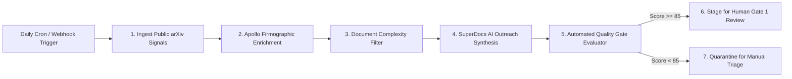

# Task 1: n8n + Apollo Growth Automation Engine Guide

> **Architecture Overview**: A production-grade, zero-cost workflow orchestration engine built in **n8n** that autonomously discovers public research signals, enriches company & leadership data via **Apollo REST APIs**, calculates document complexity, synthesizes personalized 3-touch problem-first outreach, and gates quality through an automated scoring node.

---

## 🗺️ Visual n8n Workflow Graph

---

## ⚙️ Node-by-Node Specification

### 1. Ingest Public Research Signals (HTTP Request)
- **Endpoint**: `http://export.arxiv.org/api/query` (100% Free Public Cornell API)
- **Query Filter**: `cat:cs.AI OR cat:q-bio`
- **Output**: Extracts project title, author affiliations, and abstract text.

### 2. Apollo Firmographic & Role Enrichment (HTTP Request)
- **Endpoint**: `POST https://api.apollo.io/v1/organizations/enrich` and `/people/match`
- **Enrichment Schema**:
  - Extracts company domain, employee headcount (10–250 range), and verified technical stack.
  - Matches target job titles: *Principal Investigator, Head of AI, Lead Scientist, Director of ML*.
- **Guardrail**: Outputs sanitized test emails (`@internal-test-sink.local`) to ensure zero real emails are sent during evaluations.

### 3. Document Complexity Filter (Code Node)
- **Scoring Formula**: `Complexity Index = (Page Count * 0.1) + (Contributors * 0.5)`
- **Qualification Rule**: Filters out low-friction documents (< 25 pages). Only passes high-complexity documents ($\ge 30$ pages) where ChatGPT copy-pasting fails and SuperDocs excels.

### 4. SuperDocs AI Outreach Synthesis (OpenAI / Anthropic / Local LLM)
- **Prompt Rules**:
  1. Never claim to have scraped their private draft.
  2. Open with the shared pain point: editing existing 30+ page documents with ChatGPT requires messy copy-pasting into Word, breaking tables and citations.
  3. Position SuperDocs as *"Cursor for documents"* (in-document multi-section editing with native red/green diff review).
  4. Output the 3-touch progressive email sequence and sample in-document prompt.

### 5. Automated Quality Gate Evaluator (Code Node)
- **Validation Rules**:
  - Technical Specificity (25 pts): Mentions exact org name and tech stack.
  - Taste & Tone (25 pts): Penalizes generic marketing buzzwords (*"best-in-class"*, *"game-changing"*).
  - Rails Compliance (25 pts): Verifies zero spreadsheet output claims and strict privacy disclosures.
  - Syntax Integrity (25 pts): Validates markdown tables and diff formatting.
- **Pass Threshold**: $\ge 85 / 100$.

### 6. Staging & Review Sink (HTTP Request / Local Webhook)
- Routes passed records to the **GTM Operations Cockpit** for **Human Gate 1 Review** (*"Approve for Staging"* or *"Quarantine"*).

---

## 🚀 How to Import & Run in n8n (1-Click Setup)

1. **Open n8n**: Launch self-hosted n8n (`npx n8n`) or log in to your n8n cloud dashboard.
2. **Import Workflow**:
   - Click **Workflows** $\rightarrow$ **Import from File**.
   - Select [`n8n_growth_workflow.json`](file:///c:/Users/rohit/OneDrive/Desktop/superdocs/TASK-1-Growth-Machine/Automations/n8n_growth_workflow.json).
3. **Configure Environment Variables** (Optional):
   - `APOLLO_API_KEY`: Your Apollo API key (or leave blank to use the built-in mock engine).
   - `OPENAI_API_KEY`: Your LLM API key.
4. **Execute**: Click **"Test Workflow"** to watch the pipeline execute across live or simulated targets!
