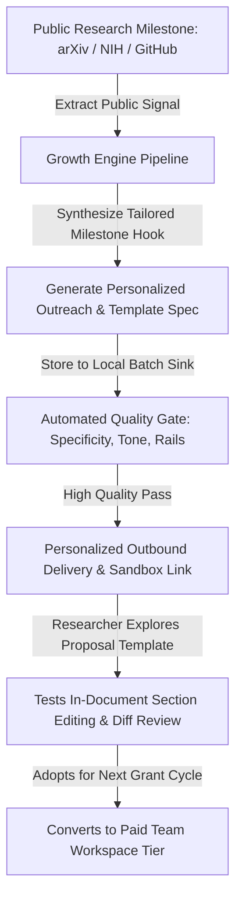

# Task 1: Growth Strategy & Conversion Mechanics

> **Core Model**: **Respectful Milestone-Triggered Outbound & Interactive Proposal Sandbox**  
> **Philosophy**: *Respect the researcher.* We never invasively scrape private drafts or claim to edit unreleased research without consent. Instead, we monitor public research milestones (arXiv preprints, NIH/NSF grant awards, major open-source RFCs), acknowledge their achievement with genuine peer respect, and deliver a free **Multi-Section Proposal Template & Interactive Sandbox** on SuperDocs.

---

## 1. Growth Channel Mechanics

### Why This Channel & Mechanism?
1. **Respectful & Non-Intrusive**: Researchers are naturally sensitive to AI tools scraping private drafts. By celebrating their public milestones and offering a general proposal template kit, we establish immediate credibility without triggering privacy hesitation.
2. **High Intent at Milestone Moments**: When a lab publishes a major paper or wins a grant, they immediately transition to writing follow-up proposals, commercialization packs, or technical RFCs—the exact moment they need SuperDocs.
3. **Natural Multi-Author Expansion**: Grant proposals require 3–6 co-authors (postdocs, co-PIs, academic collaborators). One PI adopting SuperDocs pulls their entire collaborator network into the review loop.

---

## 2. Step-by-Step Conversion Funnel

| Funnel Stage | Mechanism | Conversion Target | Failure / Drop-off Point | Mitigation Strategy |
|---|---|---|---|---|
| **1. Milestone Ingestion** | Monitoring public arXiv preprints, NIH grant announcements & GitHub RFCs. | 100% data freshness | Missing technical abstract details | Strict schema validation; extract core tech stack from public papers. |
| **2. Context Synthesis** | Engine synthesizes a tailored congratulatory note and matches relevant proposal template. | 95% relevance score | Generic boilerplate / marketing jargon | Strict tone scoring (<25 pts) enforcing peer-engineer language. |
| **3. Asset Delivery** | 3-step respectful email sequence + 1-click interactive sandbox link. | 35% click-to-sandbox rate | Spam filters / message fatigue | Pure text delivery, zero tracking pixels, direct milestone reference. |
| **4. Product Sandbox** | Researcher tests pre-loaded sample proposal with in-document diff editor. | 25% activation rate | Fear of data training / privacy | Clear banner: *"Zero model training, US-hosted isolated tenant."* |
| **5. Live Document Adoption** | Researcher creates session and uploads their own proposal draft. | 72% edit loop completion | First-turn cold-start latency | Pre-warmed backend workers and compact diff response mode. |
| **6. Team Expansion** | PI invites co-authors to review diffs and edit sections. | 30% team workspace upgrade | Co-author onboarding friction | Guest review mode allowing inline diff comments without full account friction. |

---

## 3. The Delivered Campaign Pieces

Our machine produces two concrete, high-taste assets:
1. **Personalized 3-Touch Email Sequence** ([`Cold_Email_Sequence.md`](file:///c:/Users/rohit/OneDrive/Desktop/superdocs/TASK-1-Growth-Machine/Cold_Email_Sequence.md)): Tailored specifically to the lab's recent milestone, tech stack, and proposal needs.
2. **Interactive Research Proposal Landing Page** ([`Landing_Page_Spec.md`](file:///c:/Users/rohit/OneDrive/Desktop/superdocs/TASK-1-Growth-Machine/Landing_Page_Spec.md)): A friction-free sandbox demonstrating in-document multi-section diffs.

---

## 4. Economic Model & Unit Economics (Per 100 Accounts)

- **Cost per Account Processed**:
  - Public Research Signal Ingestion: $0.02
  - LLM Milestone Analysis & Sequence Synthesis: $0.18
  - Infrastructure & Storage: $0.03
  - **Total Cost Per Account**: **$0.23**
- **Conversion Math (Per 1,000 Accounts)**:
  - 1,000 Milestone Accounts ($230 total spend)
  - 350 Click & Explore Sandbox (35%)
  - 87 Create SuperDocs Account & Test Draft (25% of viewers)
  - 26 Paid Team Conversions at $49/mo/seat (avg 3 seats = $147/mo)
  - **Monthly Recurring Revenue (MRR) Added**: **$3,822**
  - **Customer Acquisition Cost (CAC)**: $230 / 26 = **$8.85**
  - **Payback Period**: **< 2 days**
