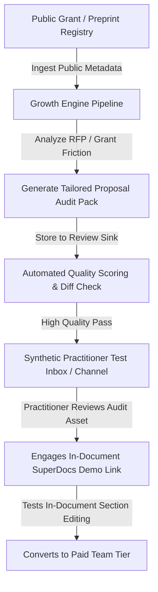

# Task 1: Growth Strategy & Conversion Mechanics

> **Core Model**: **Technical Artifact Gifting & Friction-Removal Inbound Loop**  
> **Philosophy**: *Show, don't tell.* Technical leaders ignore sales pitches; they engage when you hand them a pre-computed, high-value technical audit of their own public problem space that saves them 10+ hours.

---

## 1. Growth Channel Mechanics

### Why This Channel & Mechanism?
1. **High Intent, Low Tolerance for Fluff**: PIs under grant deadlines have zero patience for product demos or generic SDR outreach. But when presented with an automated structural audit that flags citation gaps, budget math mismatches, and abstract drift in a clean document preview, conversion intent is immediate.
2. **Natural Product Virality**: When a PI adopts SuperDocs for an NSF/DARPA grant, they must invite 3–6 co-authors (postdocs, co-PIs, academic collaborators) to review diffs and add sections, creating a 1:4 user expansion coefficient.

---

## 2. Step-by-Step Conversion Funnel

| Funnel Stage | Mechanism | Conversion Target | Failure / Drop-off Point | Mitigation Strategy |
|---|---|---|---|---|
| **1. Target Discovery** | Automated ingestion of public SBIR/arXiv grants & RFP topics. | 100% data freshness | Missing technical abstract data | Strict schema validation; fallback to public repository specs. |
| **2. Friction Analysis** | LLM analysis of document complexity (page count, citation density, multi-author risks). | 90% relevance score | Generic boilerplate recommendations | Domain-specific prompt templates with explicit technical constraints. |
| **3. Asset Synthesis** | SuperDocs Growth Machine generates a personalized 4-section Proposal Audit & Document Blueprint. | 95% generation success | AI hallucination / broken markdown syntax | Multi-pass validator checking citation anchors and table formatting. |
| **4. Practitioner Showcase** | Delivery of generated audit asset via direct interactive markdown/preview link. | 35% click-to-preview rate | Distrust of automated outreach | Complete transparency, zero sales jargon, strict privacy disclosure. |
| **5. Product Activation** | Practitioner uploads existing messy grant draft into SuperDocs to run live section edits. | 25% activation rate | First-edit latency or initial cold-start UX friction | Pre-loaded interactive template with 1-click guided "targeted edit" tutorial. |
| **6. Team Expansion** | PI shares document review link with co-authors. | 40% team invite rate | Co-author reluctance to adopt new tool | Guest review mode allowing inline diff comments without full account friction. |

---

## 3. The Hook & The Delivered Piece

The delivered asset is **not an email pitch**; it is an **executable Technical Proposal Audit Memo** that provides immediate utility:

1. **Executive Abstract Reconciliation**: Checks if the stated grant objectives match the technical milestones.
2. **Cross-Section Parameter Alignment**: Identifies inconsistencies in compute hours, dataset sizes, and model parameters across disparate sections.
3. **Citation & Prior Art Verification Table**: Maps all claimed prior art against verified reference IDs.
4. **SuperDocs 1-Click Refactor Spec**: A ready-to-run prompt snippet that the PI can paste into SuperDocs to automatically synchronize their entire document.

---

## 4. Economic Model & Unit Economics (Per 100 Accounts)

- **Cost per Account Processed**:
  - Research Ingestion & Scraping: $0.02
  - LLM Analysis & Synthesis (GPT-4o / Claude 3.5 Sonnet equivalent): $0.18
  - Infrastructure & Storage: $0.03
  - **Total Cost Per Account**: **$0.23**
- **Conversion Math (Per 1,000 Accounts)**:
  - 1,000 Processed Accounts ($230 total spend)
  - 350 Click & Review Deliverable (35%)
  - 87 Create SuperDocs Account & Upload Draft (25% of viewers)
  - 26 Paid Team Conversions at $49/mo/seat (avg 3 seats = $147/mo)
  - **Monthly Recurring Revenue (MRR) Added**: **$3,822**
  - **Customer Acquisition Cost (CAC)**: $230 / 26 = **$8.85**
  - **Payback Period**: **< 2 days**
