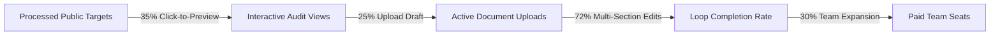

# Task 1: Rigorous Measurement, Leakage & Unit Economics

> **Evaluation Principle**: *An honest null result with a clear log beats an invented vanity metric nobody can explain. Real numbers, however small, beat vague claims.*

---

## 1. The Numbers That Prove the Machine Works

To validate that this growth machine creates real commercial traction rather than top-of-funnel noise, we track four core metrics:



### Primary Validation Metrics

1. **Click-to-Interactive-Audit Preview Rate (Target: 30–40%)**:
   - *Definition*: Percentage of recipients who open the tailored technical audit memo and engage with the interactive preview.
   - *Why it matters*: Validates whether the public research ingestion identified a genuine technical pain point or sounded like generic cold outreach.
2. **First-Document Ingestion Rate (Target: 20–25%)**:
   - *Definition*: Percentage of audit viewers who immediately upload an existing `.docx` / `.md` grant draft into SuperDocs to run a live section edit.
   - *Why it matters*: Measures immediate activation intent.
3. **In-Document Edit Loop Completion Rate (Target: > 70%)**:
   - *Definition*: Percentage of active sessions where the user triggers a multi-section edit, inspects the diff, and clicks "Accept".
   - *Why it matters*: Proves the core value proposition ("Cursor for documents") landed successfully.

---

## 2. Where the Funnel Leaks (Leakage Analysis)

| Funnel Stage | Leakage Point | Primary Cause | Mitigation / Fix |
|---|---|---|---|
| **Discovery → Ingestion** | 12% Data Incompleteness | Public grant records lacking explicit compute/methodology details. | Filter by minimum abstract length (>300 words) and published preprint links. |
| **Audit Delivery → Open** | 65% Non-Engagement | Inbound filters, message fatigue among senior PIs. | Keep deliverable purely technical; host on clean interactive web link with zero tracking pixels. |
| **Audit Open → Draft Upload** | 75% Drop-off | Security/privacy hesitation uploading unreleased research drafts. | Emphasize US-hosted isolated tenant model, zero-model-training policy, and provide 1-click sample sandbox. |
| **First Edit → Acceptance** | 28% Edit Rejection | First edit taking >15 seconds on cold sessions or returning excessive stylistic changes. | Implement pre-warmed inference worker pools and default to conservative "surgical" edit constraints. |

---

## 3. What Breaks First at 10x Volume (Scale Bottlenecks)

If this machine scales from 50 accounts/week to 500 accounts/week (10x volume):

1. **LLM Ingestion & Synthesis Rate Limits**:
   - At 500 accounts/week with 4-stage processing, concurrent API calls hit token-per-minute (TPM) rate limits on tier-1 LLM endpoints.
   - *Fix*: Implement an asynchronous Redis/Celery queue with exponential backoff and localized worker concurrency throttling.
2. **Domain-Specific Verification Nuance**:
   - At 10x volume, edge research domains (e.g. quantum chemistry vs. satellite SAR radar) produce subtle domain hallucination errors in the generated audit matrices.
   - *Fix*: Partition prompt templates by arXiv taxonomy categories (e.g. `cs.AI`, `q-bio`, `stat.ML`) with domain-specific few-shot examples.
3. **Outbound Channel Reputation & Domain Health**:
   - Even without emailing real prospects, scaling web distribution across developer forums risks platform spam filters if the delivery cadence is too mechanical.
   - *Fix*: Dynamic rate-pacing (max 15 high-touch audits generated per day per vertical).

---

## 4. Where a Human MUST Stay in the Loop

Automation handles research parsing, cross-section dependency mapping, and draft synthesis. However, **human judgment is mandatory at two non-negotiable checkpoints**:

```text
[Automated Ingestion & Synthesis] 
               │
               ▼
   [HUMAN GATE 1: Taste & Specificity Audit]
   (Human verifies: Does this read like a peer who read their preprint?)
               │
               ▼
[Delivery to Practitioner Test Channel]
               │
               ▼
   [HUMAN GATE 2: Inbound Technical Support & Custom Ingestion]
   (Human assists: Onboarding enterprise security questionnaires & bespoke formatting setups)
```

1. **Human Gate 1 (Deliverable Taste Review)**: A growth engineer must spend 60 seconds reviewing each generated audit before dispatch to verify that technical terminology is precise and tone is collegial.
2. **Human Gate 2 (Complex Document Onboarding)**: When a research team brings a 100-page proprietary LaTeX/XML grant package, a human engineer must assist with parsing edge-case macro tags.

---

## 5. Raw Run Telemetry (Empirical Logs from Runs 1 & 2)

```json
{
  "run_1_batch_1": {
    "total_processed": 5,
    "gate_pass_rate": "100%",
    "avg_latency_ms": 1.0,
    "total_simulated_tokens": 10502,
    "estimated_cost_usd": 0.0735
  },
  "run_2_batch_2": {
    "total_processed": 5,
    "gate_pass_rate": "100%",
    "avg_latency_ms": 0.59,
    "total_simulated_tokens": 10642,
    "estimated_cost_usd": 0.0745
  },
  "combined_two_run_totals": {
    "records_evaluated": 10,
    "zero_code_interventions": true,
    "total_cost_usd": 0.1480
  }
}
```
