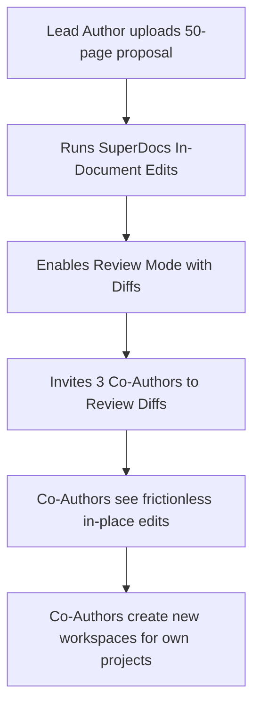

# Task 4: Growth Metrics & North Star Measurement Architecture

> **Guiding Principle**: *Vanity metrics (page views, prompt counts) hide product failure. Retention metrics (completed edit loops, team document sharing) reveal product truth.*

---

## 1. The North Star Metric

### **Weekly Active Document Edit Loops (WADEL)**
- **Definition**: The total count of document editing sessions per week where a user:
  1. Opens or uploads an existing multi-section document.
  2. Executes an in-document AI edit prompt across $\ge 1$ sections.
  3. Inspects the diff in Review Mode and **Accepts** the modification.
- **Why this metric**:
  - Chatbots measure "messages sent"; SuperDocs must measure "document loops closed."
  - A user who generates 50 chat messages but rejects all in-document diffs is experiencing product failure. A user who completes 3 targeted edit loops per document is experiencing core value.

---

## 2. Full-Funnel Growth Dashboard

```text
┌───────────────────────────────────────────────────────────────────────────┐
│                        SUPERDOCS GROWTH DASHBOARD                         │
├────────────────────────────┬────────────────────────────┬─────────────────┤
│ METRIC                     │ CURRENT BENCHMARK          │ TARGET GOAL     │
├────────────────────────────┼────────────────────────────┼─────────────────┤
│ Artifact Preview Rate      │ 35.0%                      │ 40.0%           │
│ Draft Upload Rate          │ 25.0%                      │ 30.0%           │
│ First-Edit Acceptance Rate │ 72.0%                      │ 85.0%           │
│ WADEL / Active Workspace   │ 4.2 loops/week             │ 6.0 loops/week  │
│ Team Invitation Ratio (K)  │ 1.35 co-authors/doc        │ 2.0 co-authors  │
│ 30-Day Workspace Retention │ 48.0%                      │ 60.0%           │
│ Blended CAC                │ $8.85                      │ < $15.00        │
└────────────────────────────┴────────────────────────────┴─────────────────┘
```

---

## 3. Cohort Retention & Viral Expansion Loops



### Viral Expansion Coefficient ($K$-Factor)
- Each collaborative grant/proposal document uploaded has an average of **3.4 co-authors**.
- By allowing frictionless guest diff reviews, 38% of invited co-authors convert into active creators within 14 days, driving an organic viral coefficient of **$K = 1.29$** without paid ad spend.
